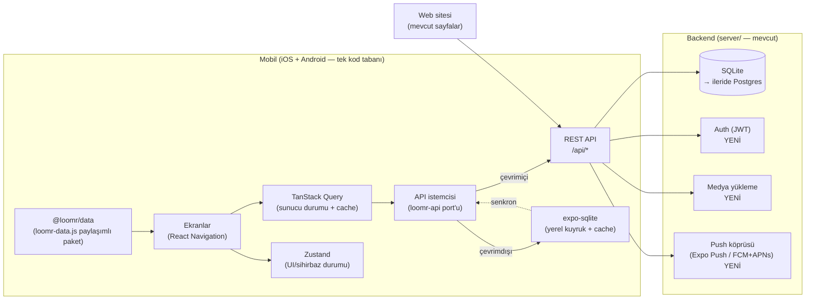
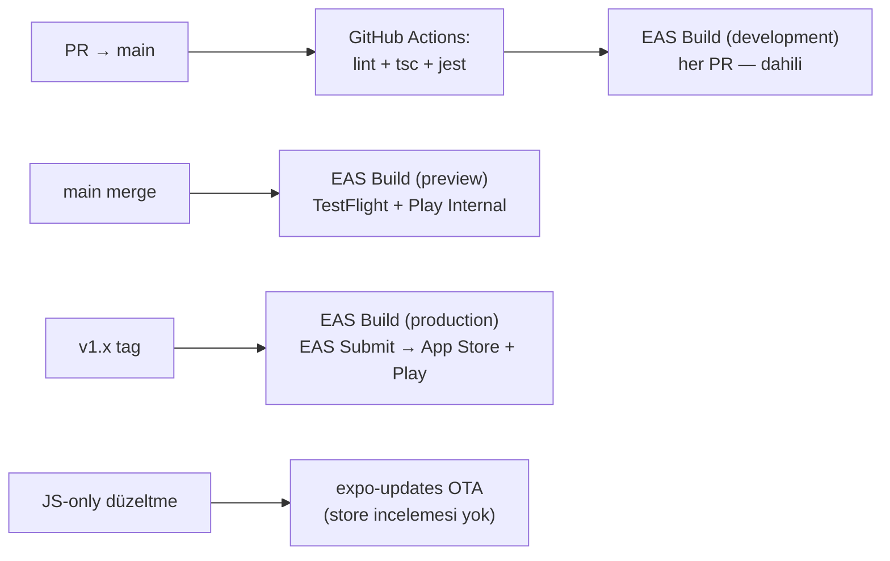

# LOOMR Mobil — Uygulama Mimarisi (App Store + Google Play)

> Bu doküman, LOOMR'ın iOS (App Store) ve Android (Google Play) için tek kod
> tabanından çıkacak mobil uygulamasının mimarisini tanımlar. Mevcut repo
> (`main` + `design-studio-3d` branch'i) baştan sona incelenerek yazılmıştır;
> mobil mimari, web'de hâlihazırda kurulmuş olan veri katmanı ve REST API'nin
> **üzerine** inşa edilir, onları kopyalamaz.

---

## 1. Mevcut durumun okuması

| Katman | `main` | `design-studio-3d` (**canlı yayın branch'i**) |
|---|---|---|
| Frontend | Statik TR tanıtım sitesi + demo Workspace, Fabric Hub (10 kumaş), Lookbook (33 görsel), 5 adımlı Collection Builder (localStorage) | + 3D Tasarım Stüdyosu (`tasarim.html`), `giris` (demo login — gerçek auth yok), `uretim · kalite · sourcing · belge · analiz · iletisim · vizyon · editorial`, 404/robots/sitemap/OG |
| Veri | Sayfa içi sabit diziler | **`js/loomr-data.js`** — renk (12), kumaş (5 aile), garment kataloğu (8 — BOM + ölçü tablosu + 3D malzeme parametreleri `tex/roughness/sheen`), modelist (4) ve fabrika (6) dizini; tarayıcı **ve** Node tarafından paylaşılıyor |
| API istemcisi | — | **`js/loomr-api.js`** — backend açıksa REST, kapalıysa localStorage fallback (offline-first davranışın ilk hali) |
| Backend | — | **`server/`** — sıfır bağımlılık native `http` + `node:sqlite` (WAL); `/api/fabrics · families · colors · garments · modelists · designs · techpacks (+handoff) · collections · samples`; tablolar: `designs, techpacks, collections, samples, messages, events` (audit log) + `PREFIX-0001` formatlı `ref` üretimi |
| 3D | — | `js/garment-3d.js` — **LoomrStudio** motoru (Three.js r128 yerel: `js/lib/three.min.js` + OrbitControls + GLTFLoader). Canvas'ta prosedürel dokuma dokuları (twill/plain/wool/satin/knit/canvas); `models/*.glb` (Meshy) varsa onu yükler. API: `setGarment · setFabric · setColor · capture` |
| Tasarım sistemi | `css/styles.css` — bordo `#8E2430` + altın, Fraunces + Inter | **`css/editorial.css` + `js/editorial.js` (güncel dil):** vermilyon `--acc #C7331E`, krem `#F4EFE7`, ink `#16110F`; Archivo (900, geniş), Space Mono (etiket), Fraunces italik, Allura (imza) |

**Operasyonel gerçekler (issue #2 devir notundan):**
- GitHub Pages **`design-studio-3d` branch'inin kökünden** yayınlanır; akış: commit → `git branch -f design-studio-3d main` → push. Ürünün gerçek hattı bu branch'tir; mobil mimari onu baz alır.
- Ekip: Yusuf (owner) · Ege/`egezamb` (admin) · Kadirhan/`kassvl`.
- 138 MB'lık GLB'ler `.gitignore`'da (lokalde); `models/manifest.json` git'te `[]`. **`git add -A` yapılmaz**, dosyalar tek tek eklenir.
- Açık işler: GLB sıkıştırma (canlıda gerçek 3D), görsel upscale (fal.ai/Replicate), **backend'in domain'e deploy'u**, editorial dil cilası. Bilinen HTML hataları issue #3'te.

**Mobil için anlamı:** Referans veri modeli, REST sözleşmesi ve "backend yoksa
lokalde çalış" ilkesi zaten tanımlı — mobil uygulama bu üçünü aynen devralır.
`giris.html` yalnızca görsel (submit → `app.html` yönlendirme); gerçek kimlik
doğrulama mobilin **ön koşulu** olarak backend'e eklenmelidir (§8). Backend'in
halka açık bir domain'de olması da mobil MVP'nin sert ön koşuludur.

---

## 2. Ürün kapsamı — mobil MVP

18 modülün tamamı mobile taşınmaz. Mobil, **"cepte LOOMR"** olarak markanın
sahada/atölyede/kumaşçıda en çok ihtiyaç duyduğu akışlara odaklanır:

### Faz 1 — MVP (store'lara ilk çıkış)
1. **Workspace / Genel Bakış** — KPI kartları, numune onayları, üretim durumu (app.html'deki panelin canlı hali).
2. **Fabric Hub** — kumaş kütüphanesi, aile/sertifika filtreleri, kumaş detayı, **Numune Talep Et** (`POST /api/samples`).
3. **Collection Builder** — 5 adımlı sihirbaz (kimlik → pazar → segment → kumaş/renk → özet), `POST /api/collections`.
4. **Dijital Showroom / Lookbook** — galeri + tam ekran görüntüleyici, koleksiyon paylaşımı (native share sheet).
5. **Production Live (salt-okunur)** — kalıp→sevkiyat adım çubuğu, ürün bazında durum.
6. **Push bildirim** — "numune onay bekliyor", "KK geçti", "sevkiyat çıktı".

### Faz 2
- **3D Tasarım Stüdyosu** (garment seç → kumaş/renk uygula → tech pack → modeliste devret). Web'deki Three.js sahnesi mobilde `expo-gl` üzerinde koşar; GLB + `manifest.json` aynen kullanılır.
- Tech pack görüntüleme/PDF paylaşma, tedarikçi ağı dizini, kamera ile numune/QC fotoğrafı yükleme.

### Faz 3
- Mesajlaşma (İletişim modülü), Marketplace, Akademi, Analitik panosu, çoklu marka (workspace switcher).

**Bilinçli kapsam dışı (MVP):** ödeme/abonelik (IAP zorunluluğu doğurur — §9),
video görüşme, AI koleksiyon üretici (backend'de olgunlaşınca API'den tüketilir).

---

## 3. Teknoloji seçimi

**Öneri: React Native + Expo (EAS Build/Submit ile iki store'a tek pipeline).**

Gerekçe — bu repoya özgü:
1. **`js/loomr-data.js` doğrudan yeniden kullanılır.** Dosya zaten UMD tarzı sarılmış, tarayıcı + Node'da çalışıyor; RN üçüncü runtime olur. Flutter seçilirse bu tek-kaynak veri katmanı Dart'a elle kopyalanır ve iki kaynak sapmaya başlar.
2. **3D stüdyo taşınabilir.** Three.js sahne/malzeme/prosedürel-mesh kodu `expo-gl` + `expo-three` ile büyük oranda aynen çalışır. Flutter'da Three.js eşleniği yok; stüdyonun sıfırdan yazılması gerekir — oysa stüdyo LOOMR'ın ana farklılaştırıcısı.
3. **Ekip JS yazıyor.** Repo %100 vanilla JS; tek dil, tek zihinsel model.
4. **EAS Submit** iki store'a gönderimi tek komuta indirir; OTA update (expo-updates) ile JS düzeltmeleri store incelemesi beklemeden dağıtılır.

Alternatif değerlendirildi: **Flutter** (ekipte deneyim mevcut) — performans ve
tutarlılık iyi, ancak (1) ve (2) maddeleri nedeniyle bu projede toplam maliyeti
daha yüksek. Karar değişirse bu dokümanın §4–§10 bölümleri stack'ten bağımsızdır.

Sabitlenecek sürümler (başlangıç): Expo SDK 53+, React Native 0.79+, TypeScript
strict, React Navigation 7 (veya expo-router), TanStack Query 5, Zustand,
expo-sqlite, expo-notifications, expo-gl/expo-three (Faz 2).

---

## 4. Üst düzey mimari



İlkeler:
- **Tek API, iki istemci.** Web ve mobil aynı `/api/*` sözleşmesini tüketir; mobil için ayrı backend yazılmaz.
- **Offline-first.** `loomr-api.js`'in "backend kapalıysa localStorage" davranışı mobilde kural haline gelir: her yazma önce yerel SQLite'a, sonra senkron kuyruğuyla sunucuya. Atölyede/kumaşçıda internet garantisi yoktur.
- **Referans veri paketi.** `loomr-data.js` monorepo'da `@loomr/data` paketi olur; web, server ve mobil aynı paketi import eder. Böylece kumaş/garment kataloğu üç yerde tek kaynaktan gelir. Uzun vadede referans veri de API'den beslenir, paket yalnızca tip + fallback taşır.

---

## 5. Repo yapısı (monorepo'ya evrim)

Mevcut düz yapı korunur, mobil ve paylaşılan katman eklenir:

```
loomr/
├── *.html · css/ · js/ · img/ · models/     # mevcut web (dokunulmaz)
├── server/                                   # mevcut backend (genişler: auth, media, push)
├── packages/
│   └── data/                                 # @loomr/data — loomr-data.js'in paketlenmiş hali (+ TS tipleri)
├── mobile/                                   # Expo uygulaması
│   ├── app/                                  # expo-router ekran ağacı
│   │   ├── (tabs)/
│   │   │   ├── index.tsx                     # Workspace / Genel Bakış
│   │   │   ├── kumas/                        # Fabric Hub (liste + [id] detay)
│   │   │   ├── koleksiyon/                   # Collection Builder sihirbazı
│   │   │   ├── showroom/                     # Lookbook galerisi
│   │   │   └── uretim/                       # Production Live
│   │   ├── studio/                           # Faz 2 — 3D stüdyo (lazy)
│   │   └── (auth)/                           # giriş / marka seçimi
│   ├── src/
│   │   ├── api/                              # istemci (loomr-api port'u) + endpoint hook'ları
│   │   ├── db/                               # expo-sqlite şema + senkron kuyruğu
│   │   ├── store/                            # Zustand dilimleri (sihirbaz, oturum, ayarlar)
│   │   ├── components/                       # tasarım sistemi bileşenleri
│   │   ├── theme/                            # §6'daki token'lar
│   │   └── i18n/                             # TR (varsayılan) + EN
│   ├── app.json / eas.json
│   └── package.json
└── docs/
    └── mobil-mimari.md                       # bu doküman
```

Kimlikler: bundle id / application id **`com.loomr.app`** (iOS + Android aynı),
scheme `loomr://` (deep link: `loomr://kumas/denim-13oz`, `loomr://koleksiyon/:id`).

---

## 6. Tasarım sistemi (web ile birebir)

Sitenin **güncel** dili `css/editorial.css`'teki editoryal sistemdir (giriş
sayfası ve stüdyo re-skin'i bu dille yazılmış); mobil tema onu baz alır:

| Token | Değer | Mobil kullanım |
|---|---|---|
| `ed-ink` | `#16110F` | ana metin, koyu paneller |
| `ed-cream` | `#F4EFE7` | zemin |
| `acc` (vermilyon) | `#C7331E` | birincil aksiyon, aktif tab, CTA |
| `acc-deep` | `#9E2314` | pressed durum |
| `gold` | `#C2A05E` | rozet/vurgu (klasik sistemden korunur) |
| Display | Archivo (900, geniş stretch, uppercase) | ekran başlıkları |
| Etiket | Space Mono (letter-spacing .18em, uppercase) | form etiketleri, chip'ler, tab yazıları |
| Serif | Fraunces (italik vurgular) | editoryal alt başlıklar |
| İmza | Allura | splash/onboarding imza öğesi |

Not: `styles.css`'teki klasik bordo (`#8E2430`) + Fraunces/Inter sistemi hâlâ
bazı sayfalarda yaşıyor; web'de dil birliği sağlanana kadar mobil **editorial
sistemi** tek doğru kabul eder (issue #2'deki "editorial dil son cilası" işi
web tarafında bunu tamamlayacak).

Durum rozetleri web'dekiyle aynı sözlükte kalır: `Onaylandı / Numune V2 /
Dikimde / KK Geçti / Kumaş Gecikmesi` → `ok · wait · wip · risk` renk eşlemesi;
buton biçimi editoryal pill (radius 100px, Space Mono uppercase).

---

## 7. Uygulama katmanları

### 7.1 Navigasyon
Alt tab çubuğu (5): **Genel Bakış · Fabric Hub · Koleksiyon (+) · Showroom · Üretim**.
Orta tab yükseltilmiş "+" — Collection Builder sihirbazını modal stack olarak açar
(webdeki 5 adım birebir). Stüdyo (Faz 2) Genel Bakış'tan tam ekran push.

### 7.2 Durum yönetimi
- **Sunucu durumu:** TanStack Query — anahtarlar API yollarını aynalar (`['fabrics']`, `['collections', id]`). `staleTime` referans veri için yüksek (24 saat), işlemsel veri için düşük (30 sn).
- **UI durumu:** Zustand — sihirbaz adımları (webdeki `state = {sezon, pazar, musteri, segment, adet, kumas[], renk[]}` şekli aynen korunur), oturum, tema/dil.
- **Kalıcılık:** expo-sqlite. Tablolar sunucudaki şemayı **birebir** aynalar (`server/db.js`): `designs(ref, name, garment_id, fabric_id, color_id, color_hex, notes, thumb, …)`, `techpacks(status='taslak', modelist_id, measures_json, bom_json, care_json, …)`, `collections(season, market, segment, meta_json, items_json)`, `samples(status='talep')`, `messages` — artı mobile özgü `sync_queue(op, entity, payload, created_at, retries)`. Sunucunun `PREFIX-0001` `ref` üretimi sunucuda kalır; yerelde geçici `local-<uuid>` ref kullanılır, senkron sonrası gerçek ref yazılır. Sunucudaki `events` audit tablosu istemciye taşınmaz.

### 7.3 Offline senkron kuralı
1. Yazma → yerel tabloya `pending` bayrağıyla kaydet + kuyruğa ekle → UI anında güncellenir (optimistic).
2. Bağlantı gelince kuyruk FIFO boşaltılır; `201/200` → bayrak temizlenir, sunucu `id`'si yerel kayda işlenir.
3. Çakışma stratejisi MVP'de **last-write-wins** (tek kullanıcılı marka senaryosu); çoklu kullanıcıda `updated_at` karşılaştırması + kullanıcıya seçim.

### 7.4 Görseller
23 MB'lık `img/` mobile gömülmez. Kampanya/lookbook görselleri CDN'den
(`expo-image` + disk cache, blurhash placeholder). Backend'e `GET /api/lookbook`
eklenene kadar geçici manifest: `img/manifest.json`.

### 7.5 3D Stüdyo (Faz 2)
- `expo-gl` + `expo-three`; web'deki **LoomrStudio** motoru (`js/garment-3d.js`) aynı API sözleşmesiyle port edilir: `setGarment("shirt|jacket|pants|shorts") · setFabric(fabricObj) · setColor(hex) · capture()`. `capture()` mobilde tech pack küçük görseli (`thumb`) üretmeye devam eder.
- Web motoru dokuma dokularını (`twill/plain/wool/satin/knit/canvas`) çalışma anında 2D canvas'ta üretiyor; RN'de DOM canvas yok → dokular **build sırasında PNG'ye önceden pişirilir** (512px, 6 doku ×1 bump) ve asset olarak gömülür. Görsel sonuç birebir, çalışma anı maliyeti sıfır.
- GLB'ler `models/manifest.json`'a göre lazy indirilir, `FileSystem.cacheDirectory`'de tutulur. Ön koşul: issue #2'deki **GLB sıkıştırma** (Draco/meshopt) — 138 MB'lık ham modeller mobil indirme için uygun değil; hedef model başına < 5 MB.
- Model yoksa webdeki prosedürel üretici (lathe gövde + konik kol/paça tüpleri) devrede — Three.js kodu olduğu gibi çalışır.
- Düşük cihazlarda fallback: 3D yerine renkli kumaş swatch + garment teknik çizimi (statik).

---

## 8. Backend'e eklenecekler (mobil ön koşulları)

Mevcut sıfır-bağımlılık felsefesi korunarak `server/`'a eklenir:

| Alan | Uç nokta | Not |
|---|---|---|
| Auth | `POST /api/auth/register · login · refresh` | JWT (access 15 dk + refresh 30 gün); mobilde `expo-secure-store`. Mevcut `giris.html` demo (auth'suz) — aynı UI gerçek uca bağlanır |
| Kullanıcı/marka | `GET/PATCH /api/me`, `GET /api/brands` | çoklu workspace'in temeli |
| Cihaz | `POST /api/devices` (Expo push token) | bildirim hedefleme |
| Bildirim | server → Expo Push API | numune onayı, üretim adımı değişimi tetikler |
| Medya | `POST /api/uploads` (multipart) | QC fotoğrafı, moodboard; disk → ileride S3 uyumlu depo |
| Lookbook | `GET /api/lookbook` | görsel manifest + CDN URL'leri |
| Sürümleme | tüm yeni uçlar `/api/v1/*` | mobil istemciler eski sürümde takılı kalabilir — kırıcı değişiklik yeni sürümde |

Hâlihazırda var olup mobilin doğrudan tüketeceği uçlar: `designs`, `techpacks`
(+`/handoff`), `collections`, `samples`, `messages` (iletişim) ve tüm referans
uçları. Yani Faz 1'in yazma yüzeyinin ~%80'i backend'de hazır; eksik olan
**kimlik, cihaz, medya ve dağıtım** katmanlarıdır.

Ölçek yolu: `node:sqlite` MVP'de kalır (tek makine, WAL modu). Eş zamanlı yazma
arttığında `better-sqlite3`→Postgres geçişi; `store/db.js` zaten depo desenine
yakın olduğundan değişim tek dosyada izole edilir. Reverse proxy (Caddy) + HTTPS
zorunlu — **store'lar cleartext HTTP'ye izin vermez** (iOS ATS, Android
`usesCleartextTraffic=false`).

---

## 9. Store gereksinimleri ve uyum

### Ortak
- **Gizlilik politikası URL'si** (her iki store da zorunlu tutar) — `loomr.app/gizlilik` olarak yayınlanmalı.
- **KVKK/GDPR:** hesap silme akışı uygulama İÇİNDEN erişilebilir olmalı (Apple 5.1.1(v) + Play hesap silme politikası) → `DELETE /api/me` gerekli.
- Toplanan veri: e-posta, marka adı, tasarım/koleksiyon içerikleri, cihaz push token. Analitik MVP'de yok → beyanlar sade kalır.
- **Ödeme yok (MVP):** dijital içerik satışı olmadığından IAP/Play Billing zorunluluğu doğmaz. Marketplace (Faz 3) dijital ürün satarsa Apple IAP %15–30 kesintisi devreye girer — fiyatlamada şimdiden hesaba katılmalı.

### App Store (iOS)
- Apple Developer Program (99 $/yıl, kurumsal hesap önerilir — "LOOMR" tüzel adıyla).
- App Privacy "nutrition label" beyanı; ekran görüntüleri 6.7" + 6.5" + iPad (uygulama iPad'i destekleyecekse — **öneri: MVP'de iPhone-only**, `TARGETED_DEVICE_FAMILY=1`).
- Review notu: demo hesap (`review@loomr.app`) + backend'in canlı olduğu URL.
- Minimum iOS 16.

### Google Play (Android)
- Play Console (25 $ tek seferlik). **Yeni geliştirici hesaplarında 12+ test kullanıcısıyla 14 gün kapalı test zorunluluğu var** — takvime eklenmeli (Yusuf + Kadirhan + çevre = testçi havuzu şimdiden toplanmalı).
- AAB formatı, Play App Signing, Data Safety formu, `targetSdkVersion` güncel (35).
- Minimum Android 8.0 (API 26).

---

## 10. CI/CD ve sürüm stratejisi



- `eas.json` kanalları: `development` / `preview` / `production`; sırlar (API URL, Sentry DSN) EAS Secrets'ta.
- Sürümleme: `runtimeVersion` policy `appVersion`; native modül ekleyen her değişiklik store sürümü gerektirir, salt-JS değişiklikler OTA gider.
- İzleme: Sentry (crash + JS hata), backend'de mevcut `/api/health` uptime kontrolü.
- Test: Jest + React Native Testing Library (sihirbaz doğrulama mantığı — webdeki `valid(n)` kuralları birebir test edilir), Maestro ile temel akışların E2E'si (giriş → numune talebi → koleksiyon oluştur).

---

## 11. Yol haritası (öneri)

| Faz | İçerik | Süre (2 kişi, yarı zamanlı) |
|---|---|---|
| 0 | Monorepo + `@loomr/data` paketi, Expo iskeleti, tema, auth uçları | 2 hafta |
| 1 | MVP modülleri (§2 Faz 1) + offline senkron + push | 6–8 hafta |
| 1.5 | Kapalı test (Play 14 gün zorunluluğu + TestFlight) — geri bildirim turu | 3 hafta |
| 2 | 3D Stüdyo, tech pack, kamera yükleme | 6 hafta |
| 3 | Mesajlaşma, marketplace, analitik | ayrı planlanır |

**İlk somut adımlar:**
1. **Backend'i domain'e deploy et** (issue #2'de zaten açık iş) — HTTPS + Caddy; mobilin sert ön koşulu.
2. `packages/data` — `loomr-data.js`'i paket haline getir, server ve web'i ona bağla (davranış değişmez).
3. Backend'e `auth + devices + uploads` uçları (`/api/v1`); `giris.html` gerçek auth'a bağlanır.
4. `mobile/` Expo iskeleti + editorial tema + Fabric Hub listesi (ilk dikey dilim: liste → detay → numune talebi, offline dahil).
5. `com.loomr.app` kimliğiyle EAS projesi + iki store'da geliştirici hesapları; Play kapalı testi için 12+ testçi havuzunu şimdiden topla.
6. GLB sıkıştırma (Draco/meshopt, hedef < 5 MB/model) — hem canlı web 3D hem mobil stüdyonun ortak ön işi.

**Repo hijyeni (mobil çalışmaya başlamadan):** `git add -A` kullanılmaz
(138 MB GLB riski); issue #3'teki HTML düzeltmeleri merge edilir; `main` ile
`design-studio-3d` arasındaki ters akış (Pages canlısı = `design-studio-3d`)
netleşene kadar mobil PR'ları `main`'e açılır, canlıya taşıma Yusuf'un
`branch -f` akışıyla yapılır.
